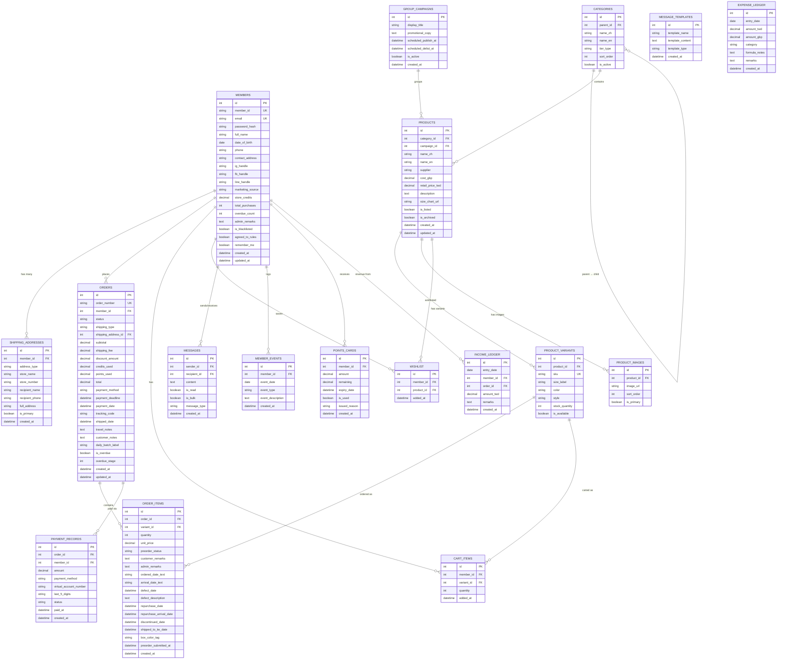

# Heart Kids Wear — Database Schema Documentation

> **Database Engine**: SQLite (via SQLAlchemy ORM)
> **Migration Tool**: Alembic
> **Future Migration Path**: PostgreSQL (schema is designed to be compatible)

---

## Entity Relationship Diagram



---

## Detailed Table Specifications

### 1. `members` — Member Accounts

Stores all registered customer accounts with profile data, financial metrics, and admin notes.

| Column | Type | Constraints | Default | Description |
|--------|------|-------------|---------|-------------|
| `id` | INTEGER | PK, AUTO_INCREMENT | — | Internal row ID |
| `member_id` | VARCHAR(10) | UNIQUE, NOT NULL | — | Public member ID. Format: `YYMM` + 3-digit seq (e.g., `2604004` = 4th member in Apr 2026) |
| `email` | VARCHAR(255) | UNIQUE, NOT NULL | — | Login email. **Stored lowercase** for case-insensitive matching |
| `password_hash` | VARCHAR(255) | NOT NULL | — | Bcrypt-hashed password |
| `full_name` | VARCHAR(100) | NOT NULL | — | Real name (matches ID). **Immutable after registration** |
| `date_of_birth` | DATE | NULL | — | Birthday |
| `phone` | VARCHAR(20) | NOT NULL | — | Primary phone number |
| `contact_address` | TEXT | NULL | — | Residential/contact address |
| `ig_handle` | VARCHAR(100) | NULL | — | Instagram account name |
| `fb_handle` | VARCHAR(100) | NULL | — | Facebook account name |
| `line_handle` | VARCHAR(100) | NULL | — | LINE community account name |
| `marketing_source` | VARCHAR(20) | NOT NULL | — | How they found us: `FB`, `IG`, or `LINE` |
| `store_credits` | DECIMAL(10,2) | NOT NULL | `0.00` | Available store credits (永久有效, no expiry) |
| `total_purchases` | INTEGER | NOT NULL | `0` | Lifetime purchase count |
| `overdue_count` | INTEGER | NOT NULL | `0` | Cumulative overdue/default count (黑名單依據) |
| `admin_remarks` | TEXT | NULL | — | Internal admin notes (e.g., "慣性延遲繳款") |
| `is_blacklisted` | BOOLEAN | NOT NULL | `FALSE` | Service suspension flag |
| `agreed_to_rules` | BOOLEAN | NOT NULL | `FALSE` | Agreed to shopping rules checkbox |
| `remember_me` | BOOLEAN | NOT NULL | `FALSE` | Remember account preference |
| `created_at` | DATETIME | NOT NULL | `CURRENT_TIMESTAMP` | Registration timestamp |
| `updated_at` | DATETIME | NOT NULL | `CURRENT_TIMESTAMP` | Last profile update |

> [!IMPORTANT]
> **Member ID Generation Logic**: When a new member makes their first purchase, the system generates their Member ID as `YYMM` + zero-padded sequential number. Example: 4th new customer in April 2026 → `2604004`.

> [!NOTE]
> **Email Case Insensitivity**: All emails are normalized to lowercase before storage and comparison. `John@Gmail.com` and `john@gmail.com` are treated as the same account.

**Indexes:**
- `idx_members_email` on `email` (login lookups)
- `idx_members_member_id` on `member_id` (admin CRM search)
- `idx_members_full_name` on `full_name` (admin CRM search)

---

### 2. `shipping_addresses` — Delivery Addresses

Multiple shipping addresses per member. Supports both 7-11 store pickup and post office home delivery.

| Column | Type | Constraints | Default | Description |
|--------|------|-------------|---------|-------------|
| `id` | INTEGER | PK, AUTO_INCREMENT | — | Internal row ID |
| `member_id` | INTEGER | FK → members.id, NOT NULL | — | Owner member |
| `address_type` | VARCHAR(20) | NOT NULL | — | `SEVEN_ELEVEN` or `POST_OFFICE` |
| `store_name` | VARCHAR(100) | NULL | — | 7-11 store name (only for SEVEN_ELEVEN type) |
| `store_number` | VARCHAR(20) | NULL | — | 7-11 store number/code |
| `recipient_name` | VARCHAR(100) | NOT NULL | — | Recipient name (**must match ID** per spec) |
| `recipient_phone` | VARCHAR(20) | NOT NULL | — | Recipient phone number |
| `full_address` | TEXT | NULL | — | Full delivery address (only for POST_OFFICE type) |
| `is_primary` | BOOLEAN | NOT NULL | `FALSE` | Primary/default address flag |
| `created_at` | DATETIME | NOT NULL | `CURRENT_TIMESTAMP` | When this address was saved |

> [!TIP]
> **Auto-fill at Checkout**: The checkout flow automatically populates the member's primary address. If modified during checkout, the new address is auto-saved as a new entry for future dropdown selection.

**Indexes:**
- `idx_shipping_member` on `member_id`

---

### 3. `categories` — Two-Tier Product Categories

Self-referencing hierarchy: Tier 1 (Gender/Type) → Tier 2 (Age Groups).

| Column | Type | Constraints | Default | Description |
|--------|------|-------------|---------|-------------|
| `id` | INTEGER | PK, AUTO_INCREMENT | — | Internal row ID |
| `parent_id` | INTEGER | FK → categories.id, NULL | — | NULL = top-level (Tier 1) |
| `name_zh` | VARCHAR(50) | NOT NULL | — | Chinese name (e.g., "男孩", "2-3歲") |
| `name_en` | VARCHAR(50) | NOT NULL | — | English name (e.g., "Boys", "Age 2-3") |
| `tier_type` | VARCHAR(20) | NOT NULL | — | `GENDER_TYPE` (Tier 1) or `AGE_GROUP` (Tier 2) |
| `sort_order` | INTEGER | NOT NULL | `0` | Display ordering |
| `is_active` | BOOLEAN | NOT NULL | `TRUE` | Visibility toggle |

**Tier 1 Seed Data:**
| name_zh | name_en |
|---------|---------|
| 男孩 | Boys |
| 女孩 | Girls |
| 男寶 | Baby Boys |
| 女寶 | Baby Girls |
| 其他（配件、玩具與書本）| Others (Accessories, Toys & Books) |

---

### 4. `group_campaigns` — Brand Group Buying Campaigns

Campaigns group products under a customizable title (hiding actual brand name to prevent competitor copying).

| Column | Type | Constraints | Default | Description |
|--------|------|-------------|---------|-------------|
| `id` | INTEGER | PK, AUTO_INCREMENT | — | Internal row ID |
| `display_title` | VARCHAR(200) | NOT NULL | — | Public campaign title (hides brand name) |
| `promotional_copy` | TEXT | NULL | — | Marketing copy displayed below the title |
| `scheduled_publish_at` | DATETIME | NULL | — | Auto-publish time (NULL = manual) |
| `scheduled_delist_at` | DATETIME | NULL | — | Auto-delist time (NULL = manual) |
| `is_active` | BOOLEAN | NOT NULL | `FALSE` | Currently live on frontend |
| `created_at` | DATETIME | NOT NULL | `CURRENT_TIMESTAMP` | Creation timestamp |

---

### 5. `products` — Product Catalog

Main product records. Each product may belong to a category and optionally a group campaign.

| Column | Type | Constraints | Default | Description |
|--------|------|-------------|---------|-------------|
| `id` | INTEGER | PK, AUTO_INCREMENT | — | Internal row ID |
| `category_id` | INTEGER | FK → categories.id, NULL | — | Product category |
| `campaign_id` | INTEGER | FK → group_campaigns.id, NULL | — | Optional group campaign |
| `name_zh` | VARCHAR(200) | NOT NULL | — | Chinese product name |
| `name_en` | VARCHAR(200) | NULL | — | English product name |
| `supplier` | VARCHAR(100) | NULL | — | Vendor/supplier name (admin-only) |
| `cost_gbp` | DECIMAL(10,2) | NULL | — | Purchase cost in GBP (admin-only) |
| `retail_price_twd` | DECIMAL(10,2) | NOT NULL | — | Retail price in TWD (displayed as NT$X,XXX) |
| `description` | TEXT | NULL | — | Product description |
| `size_chart_url` | VARCHAR(500) | NULL | — | URL/path to brand size chart image |
| `is_listed` | BOOLEAN | NOT NULL | `FALSE` | Currently visible on frontend |
| `is_archived` | BOOLEAN | NOT NULL | `FALSE` | Soft-archived (retained for one-click relaunch) |
| `created_at` | DATETIME | NOT NULL | `CURRENT_TIMESTAMP` | Creation timestamp |
| `updated_at` | DATETIME | NOT NULL | `CURRENT_TIMESTAMP` | Last update |

> [!NOTE]
> **Archiving**: When products are delisted, `is_listed = FALSE` and `is_archived = TRUE`. They remain in the database for future relisting. Admin can update price and one-click relaunch by toggling `is_listed = TRUE, is_archived = FALSE`.

**Indexes:**
- `idx_products_category` on `category_id`
- `idx_products_campaign` on `campaign_id`
- `idx_products_name` on `name_zh` (search)
- `idx_products_listed` on `is_listed` (frontend queries)

---

### 6. `product_variants` — Individual SKUs (Size/Color/Style)

Every size/color combination gets its own independent SKU code, per spec requirement.

| Column | Type | Constraints | Default | Description |
|--------|------|-------------|---------|-------------|
| `id` | INTEGER | PK, AUTO_INCREMENT | — | Internal row ID |
| `product_id` | INTEGER | FK → products.id, NOT NULL | — | Parent product |
| `sku` | VARCHAR(50) | UNIQUE, NOT NULL | — | Independent SKU code per variant |
| `size_label` | VARCHAR(20) | NULL | — | Size (e.g., "2-3y", "3-4y", "4-5y") |
| `color` | VARCHAR(50) | NULL | — | Color variant |
| `style` | VARCHAR(100) | NULL | — | Style variant |
| `stock_quantity` | INTEGER | NOT NULL | `0` | Available stock count |
| `is_available` | BOOLEAN | NOT NULL | `TRUE` | Purchasable flag |

> [!IMPORTANT]
> **Independent SKU Logic**: Each variant MUST have a unique SKU. Example: "Thomas Short-Sleeve Tee" in sizes 2-3y, 3-4y, 4-5y → 3 separate SKU codes, NOT one shared code.

**Indexes:**
- `idx_variants_product` on `product_id`
- `idx_variants_sku` on `sku` (UNIQUE)

---

### 7. `product_images` — Product Image Gallery

| Column | Type | Constraints | Default | Description |
|--------|------|-------------|---------|-------------|
| `id` | INTEGER | PK, AUTO_INCREMENT | — | Internal row ID |
| `product_id` | INTEGER | FK → products.id, NOT NULL | — | Parent product |
| `image_url` | VARCHAR(500) | NOT NULL | — | Image file path/URL |
| `sort_order` | INTEGER | NOT NULL | `0` | Display ordering |
| `is_primary` | BOOLEAN | NOT NULL | `FALSE` | Primary/thumbnail image flag |

---

### 8. `orders` — Customer Orders

Central order record tracking the full lifecycle from submission to fulfillment.

| Column | Type | Constraints | Default | Description |
|--------|------|-------------|---------|-------------|
| `id` | INTEGER | PK, AUTO_INCREMENT | — | Internal row ID |
| `order_number` | VARCHAR(20) | UNIQUE, NOT NULL | — | Public order #. Format: `YYMM` + 4-digit seq (e.g., `26040001`) |
| `member_id` | INTEGER | FK → members.id, NOT NULL | — | Ordering member |
| `status` | VARCHAR(30) | NOT NULL | `PENDING` | Order lifecycle status (see enum below) |
| `shipping_type` | VARCHAR(20) | NOT NULL | — | `SEVEN_ELEVEN` or `POST_OFFICE` |
| `shipping_address_id` | INTEGER | FK → shipping_addresses.id, NULL | — | Selected shipping address |
| `subtotal` | DECIMAL(10,2) | NOT NULL | — | Item total (before shipping/discounts) |
| `shipping_fee` | DECIMAL(10,2) | NOT NULL | — | NT$60 (7-11) or NT$80 (Post Office) |
| `discount_amount` | DECIMAL(10,2) | NOT NULL | `0.00` | NT$60 bulk discount (if subtotal ≥ NT$4,000) |
| `credits_used` | DECIMAL(10,2) | NOT NULL | `0.00` | Store credits applied |
| `points_used` | DECIMAL(10,2) | NOT NULL | `0.00` | Points card value applied |
| `total` | DECIMAL(10,2) | NOT NULL | — | Final payable amount |
| `payment_method` | VARCHAR(30) | NULL | — | `VIRTUAL_ACCOUNT`, `MANUAL_TRANSFER`, `CREDIT_CARD` |
| `payment_deadline` | DATETIME | NULL | — | Checkout deadline set by admin |
| `payment_date` | DATETIME | NULL | — | Actual payment received date (auto from virtual account) |
| `tracking_code` | VARCHAR(50) | NULL | — | 7-11 C2C tracking code (e.g., M7788XXXXX) |
| `shipped_date` | DATETIME | NULL | — | Date items dispatched to customer |
| `travel_notes` | TEXT | NULL | — | Customer's travel schedule notes |
| `customer_notes` | TEXT | NULL | — | Post-payment customer remarks |
| `daily_batch_label` | VARCHAR(30) | NULL | — | Daily order batch label (e.g., "2026/04/11 (1)") |
| `is_overdue` | BOOLEAN | NOT NULL | `FALSE` | Whether order has passed deadline |
| `overdue_stage` | INTEGER | NOT NULL | `0` | Escalation stage: 0=none, 1=grace, 2=final warning, 3=abandoned |
| `created_at` | DATETIME | NOT NULL | `CURRENT_TIMESTAMP` | Order creation timestamp |
| `updated_at` | DATETIME | NOT NULL | `CURRENT_TIMESTAMP` | Last update |

**Order Status Enum Values:**

| Status | Description |
|--------|-------------|
| `PENDING` | Order submitted, awaiting admin confirmation |
| `CONFIRMED` | Admin confirmed all items procured correctly → triggers payment notification |
| `PAYMENT_NOTIFIED` | Payment notification sent to customer |
| `PAID` | Payment confirmed (auto or manual) |
| `PROCESSING` | Items being procured/shipped from UK |
| `SHIPPED_TO_TW` | Items shipped from UK to Taiwan |
| `ARRIVED_TW` | Items arrived in Taiwan |
| `SHIPPED_TO_CUSTOMER` | Dispatched to customer via 7-11/Post Office |
| `DELIVERED` | Customer received items |
| `OVERDUE_GRACE` | Past deadline, in 3-day grace period |
| `OVERDUE_FINAL` | Final warning sent |
| `ABANDONED` | Auto-abandoned after grace period (棄單) |
| `CANCELLED` | Manually cancelled |

> [!IMPORTANT]
> **Order Number Format**: `YYMM` + 4-digit zero-padded sequential number. First order of April 2026 = `26040001`. Resets monthly.

> [!IMPORTANT]
> **Shipping Fee Logic**:
> - 7-11 Store-to-Store: Fixed NT$60
> - Post Office Home Delivery: Fixed NT$80
> - **Auto-lock**: If total item count > 15, system forces `POST_OFFICE` only

> [!IMPORTANT]
> **Discount Logic**: If `subtotal ≥ NT$4,000` (excluding shipping) AND order is not overdue → auto-deduct NT$60. If order becomes overdue, discount is reverted.

**Indexes:**
- `idx_orders_member` on `member_id`
- `idx_orders_number` on `order_number` (UNIQUE)
- `idx_orders_status` on `status`
- `idx_orders_created` on `created_at`
- `idx_orders_payment_deadline` on `payment_deadline`

---

### 9. `order_items` — Individual Items Within Orders

Each line item with its own procurement tracking fields and dual-track remarks.

| Column | Type | Constraints | Default | Description |
|--------|------|-------------|---------|-------------|
| `id` | INTEGER | PK, AUTO_INCREMENT | — | Internal row ID |
| `order_id` | INTEGER | FK → orders.id, NOT NULL | — | Parent order |
| `variant_id` | INTEGER | FK → product_variants.id, NOT NULL | — | Product variant (SKU) ordered |
| `quantity` | INTEGER | NOT NULL | `1` | Quantity ordered |
| `unit_price` | DECIMAL(10,2) | NOT NULL | — | Price per unit at time of purchase |
| `preorder_status` | VARCHAR(20) | NOT NULL | `IN_PROGRESS` | `IN_PROGRESS` / `REGISTERED` / `OUT_OF_STOCK` |
| `customer_remarks` | TEXT | NULL | — | Notes visible to customer (給客人看的備註) |
| `admin_remarks` | TEXT | NULL | — | Internal notes (僅後台看得到的備註) |
| `ordered_date_text` | VARCHAR(50) | NULL | — | Free-text ordered date (e.g., "2026/6/7(1)"). Default placeholder: "未訂貨" |
| `arrival_date_text` | VARCHAR(50) | NULL | — | Free-text arrival date (e.g., "2026/6/7(2)"). Default placeholder: "未到貨" |
| `defect_date` | DATETIME | NULL | — | Date defect was found. NULL = "無瑕疵" |
| `defect_description` | TEXT | NULL | — | Free-text defect details |
| `repurchase_date` | DATETIME | NULL | — | Re-order date. NULL = "未重買" |
| `repurchase_arrival_date` | DATETIME | NULL | — | Re-ordered item arrival date |
| `discontinued_date` | DATETIME | NULL | — | Confirmed out-of-stock date. NULL = "未斷貨". **Triggers store credit refund** |
| `shipped_to_tw_date` | DATETIME | NULL | — | Shipped from UK to Taiwan date |
| `box_color_tag` | VARCHAR(50) | NULL | — | Color-coded cargo box identifier |
| `preorder_submitted_at` | DATETIME | NOT NULL | — | Precise submission time (YYYY-MM-DD HH:MM:SS). **Allocation priority key** |
| `created_at` | DATETIME | NOT NULL | `CURRENT_TIMESTAMP` | Record creation |

> [!IMPORTANT]
> **Dual-Track Remarks System**:
> - `customer_remarks`: Synced and visible to the member on the frontend
> - `admin_remarks`: Strictly internal, never exposed to customers

> [!IMPORTANT]
> **`preorder_submitted_at`**: This is the absolute criterion for allocation priority when stock is limited. Must be precise to the second.

> [!WARNING]
> **Discontinued → Auto-Refund**: When `discontinued_date` is set (admin marks item as OUT_OF_STOCK), the system MUST automatically credit `unit_price × quantity` to the member's `store_credits`.

> [!NOTE]
> **Flexible Date Fields**: `ordered_date_text` and `arrival_date_text` are free-text (NOT strict date pickers) to support batch annotations like "2026/6/7(1)" or "2026/6/7(2)" for multiple purchases on the same day.

**Indexes:**
- `idx_order_items_order` on `order_id`
- `idx_order_items_variant` on `variant_id`
- `idx_order_items_status` on `preorder_status`
- `idx_order_items_submitted` on `preorder_submitted_at`

---

### 10. `wishlist` — Member Wish List

| Column | Type | Constraints | Default | Description |
|--------|------|-------------|---------|-------------|
| `id` | INTEGER | PK, AUTO_INCREMENT | — | Internal row ID |
| `member_id` | INTEGER | FK → members.id, NOT NULL | — | Member |
| `product_id` | INTEGER | FK → products.id, NOT NULL | — | Wishlisted product |
| `added_at` | DATETIME | NOT NULL | `CURRENT_TIMESTAMP` | When added |

**Constraints:** UNIQUE(`member_id`, `product_id`)

---

### 11. `cart_items` — Shopping Cart

| Column | Type | Constraints | Default | Description |
|--------|------|-------------|---------|-------------|
| `id` | INTEGER | PK, AUTO_INCREMENT | — | Internal row ID |
| `member_id` | INTEGER | FK → members.id, NOT NULL | — | Member |
| `variant_id` | INTEGER | FK → product_variants.id, NOT NULL | — | Product variant |
| `quantity` | INTEGER | NOT NULL | `1` | Quantity in cart |
| `added_at` | DATETIME | NOT NULL | `CURRENT_TIMESTAMP` | When added to cart |

---

### 12. `messages` — Chat / Messaging System

Supports personal messages, bulk broadcasts, and system-generated notifications.

| Column | Type | Constraints | Default | Description |
|--------|------|-------------|---------|-------------|
| `id` | INTEGER | PK, AUTO_INCREMENT | — | Internal row ID |
| `sender_id` | INTEGER | FK → members.id, NULL | — | Sender (NULL = system message) |
| `recipient_id` | INTEGER | FK → members.id, NOT NULL | — | Recipient member |
| `content` | TEXT | NOT NULL | — | Message body (supports emoji) |
| `is_read` | BOOLEAN | NOT NULL | `FALSE` | Read/unread status |
| `is_bulk` | BOOLEAN | NOT NULL | `FALSE` | Part of a bulk broadcast |
| `message_type` | VARCHAR(20) | NOT NULL | `PERSONAL` | `PERSONAL` / `BULK` / `SYSTEM` / `AUTO_REPLY` |
| `created_at` | DATETIME | NOT NULL | `CURRENT_TIMESTAMP` | Sent timestamp |

> [!NOTE]
> **Auto-Reply**: When a customer sends their first message in a session, the system auto-generates an `AUTO_REPLY` message with the canned welcome text.

> [!NOTE]
> **Email Trigger**: When `message_type = PERSONAL` and `sender_id` is an admin, the system also sends an email notification to the recipient's registered email.

**Indexes:**
- `idx_messages_recipient` on `recipient_id`
- `idx_messages_sender` on `sender_id`
- `idx_messages_read` on `(recipient_id, is_read)` (unread count badge)

---

### 13. `message_templates` — Reusable Message Templates

| Column | Type | Constraints | Default | Description |
|--------|------|-------------|---------|-------------|
| `id` | INTEGER | PK, AUTO_INCREMENT | — | Internal row ID |
| `template_name` | VARCHAR(100) | NOT NULL | — | Template label |
| `template_content` | TEXT | NOT NULL | — | Body with placeholders: `{{name}}`, `{{tracking}}`, `{{date}}` |
| `template_type` | VARCHAR(30) | NOT NULL | — | `SHIPPING` / `PAYMENT_REMINDER` / `OVERDUE` / `PICKUP_REMINDER` / `CUSTOM` |
| `created_at` | DATETIME | NOT NULL | `CURRENT_TIMESTAMP` | Creation date |

**Pre-seeded Templates (from spec):**
1. Shipping Notification (7-11)
2. 7-11 Pickup Deadline Reminder
3. Payment Deadline Reminder (Day 0)
4. Grace Period Notice (Day 1)
5. Final Warning (Day 3-4)
6. Chat Auto-Reply Welcome

---

### 14. `points_cards` — Reward Points / Bonus Cards

| Column | Type | Constraints | Default | Description |
|--------|------|-------------|---------|-------------|
| `id` | INTEGER | PK, AUTO_INCREMENT | — | Internal row ID |
| `member_id` | INTEGER | FK → members.id, NOT NULL | — | Recipient member |
| `amount` | DECIMAL(10,2) | NOT NULL | — | Points value (1 point = NT$1) |
| `remaining` | DECIMAL(10,2) | NOT NULL | — | Unused balance |
| `expiry_date` | DATETIME | NULL | — | Individual expiry date (NULL = no expiry) |
| `is_used` | BOOLEAN | NOT NULL | `FALSE` | Fully redeemed flag |
| `issued_reason` | VARCHAR(100) | NULL | — | "Registration bonus", "Lucky draw", etc. |
| `created_at` | DATETIME | NOT NULL | `CURRENT_TIMESTAMP` | Issue date |

> [!IMPORTANT]
> **Checkout Constraint**: Only ONE points card can be used per checkout transaction.

> [!NOTE]
> **Registration Bonus**: New members receive a 60-point card (= NT$60 = free 7-11 shipping).

**Indexes:**
- `idx_points_member` on `member_id`
- `idx_points_expiry` on `expiry_date` (for expiry notification scheduler)

---

### 15. `member_events` — Event Timeline Log

Chronological audit trail for each member's significant account events.

| Column | Type | Constraints | Default | Description |
|--------|------|-------------|---------|-------------|
| `id` | INTEGER | PK, AUTO_INCREMENT | — | Internal row ID |
| `member_id` | INTEGER | FK → members.id, NOT NULL | — | Member |
| `event_date` | DATE | NOT NULL | — | Event occurrence date |
| `event_type` | VARCHAR(30) | NOT NULL | — | Event category (see enum below) |
| `event_description` | TEXT | NULL | — | Detailed notes |
| `created_at` | DATETIME | NOT NULL | `CURRENT_TIMESTAMP` | Log creation timestamp |

**Event Type Enum:**

| Value | Description |
|-------|-------------|
| `LATE_PAYMENT` | Failed to pay before deadline (遲繳) |
| `STOCKOUT_REFUND` | Item discontinued → store credit refund (斷貨退購物金) |
| `PACKAGE_RETURNED` | 7-11 uncollected package returned to warehouse (退回重寄) |
| `ORDER_ABANDONED` | Order abandoned after grace period (棄單) |
| `CREDIT_ADJUSTMENT` | Manual store credit adjustment by admin |
| `POINTS_ISSUED` | Points card issued by admin |
| `NOTE` | General admin notation |

**Indexes:**
- `idx_events_member` on `member_id`
- `idx_events_type` on `event_type`
- `idx_events_date` on `event_date`

---

### 16. `payment_records` — Payment Ledger

Archival record of all successful payments.

| Column | Type | Constraints | Default | Description |
|--------|------|-------------|---------|-------------|
| `id` | INTEGER | PK, AUTO_INCREMENT | — | Internal row ID |
| `order_id` | INTEGER | FK → orders.id, NOT NULL | — | Associated order |
| `member_id` | INTEGER | FK → members.id, NOT NULL | — | Paying member |
| `amount` | DECIMAL(10,2) | NOT NULL | — | Payment amount |
| `payment_method` | VARCHAR(30) | NOT NULL | — | `VIRTUAL_ACCOUNT` / `MANUAL_TRANSFER` / `CREDIT_CARD` |
| `virtual_account_number` | VARCHAR(50) | NULL | — | Virtual account number (if applicable) |
| `last_5_digits` | VARCHAR(5) | NULL | — | Last 5 digits of transfer (for manual reporting) |
| `status` | VARCHAR(20) | NOT NULL | `PENDING` | `PENDING` / `CONFIRMED` / `FAILED` |
| `paid_at` | DATETIME | NULL | — | Confirmed payment timestamp |
| `created_at` | DATETIME | NOT NULL | `CURRENT_TIMESTAMP` | Record creation |

> [!NOTE]
> **Mock Payment Flag**: A system configuration flag `PAYMENT_GATEWAY_ENABLED` (default: `FALSE`) controls whether real payment gateway integration is active. When `FALSE`, admins confirm payments manually via the backend. All payments are still fully logged regardless.

**Indexes:**
- `idx_payments_order` on `order_id`
- `idx_payments_member` on `member_id`
- `idx_payments_paid_at` on `paid_at` (for date-range filtering: year/month/day)
- `idx_payments_status` on `status`

---

### 17. `expense_ledger` — Business Expense Records

Monthly expense tracking with formula support for international freight calculations.

| Column | Type | Constraints | Default | Description |
|--------|------|-------------|---------|-------------|
| `id` | INTEGER | PK, AUTO_INCREMENT | — | Internal row ID |
| `entry_date` | DATE | NOT NULL | — | Expense date |
| `amount_twd` | DECIMAL(12,2) | NOT NULL | `0.00` | Amount in NT$ |
| `amount_gbp` | DECIMAL(12,2) | NOT NULL | `0.00` | Amount in GBP |
| `category` | VARCHAR(30) | NOT NULL | — | Expense category (see enum below) |
| `formula_notes` | TEXT | NULL | — | Formula details (e.g., "17.25kg × rate", "60×42×40cm / 5000") |
| `remarks` | TEXT | NULL | — | Free-text notes (logistics arrival times, over-orders, etc.) |
| `created_at` | DATETIME | NOT NULL | `CURRENT_TIMESTAMP` | Record creation |

**Expense Category Enum:**

| Value | Description |
|-------|-------------|
| `ASSISTANT_SALARY` | 妹妹薪水 — Local assistant payroll |
| `UK_LOCAL_SHIPPING` | 英國本地運費 — UK domestic courier fees |
| `INTL_FREIGHT` | 英台國際運費 — UK→Taiwan international freight |
| `PACKAGING` | 包裝耗材 — Transparent bags, poly mailers, stickers, tape, boxes |
| `OTHER` | Other expenses |

**Indexes:**
- `idx_expense_date` on `entry_date`
- `idx_expense_category` on `category`

---

### 18. `income_ledger` — Revenue Records

| Column | Type | Constraints | Default | Description |
|--------|------|-------------|---------|-------------|
| `id` | INTEGER | PK, AUTO_INCREMENT | — | Internal row ID |
| `entry_date` | DATE | NOT NULL | — | Payment collection date |
| `member_id` | INTEGER | FK → members.id, NULL | — | Linked customer (if applicable) |
| `order_id` | INTEGER | FK → orders.id, NULL | — | Linked order (if applicable) |
| `amount_twd` | DECIMAL(12,2) | NOT NULL | — | Gross revenue in NT$ |
| `remarks` | TEXT | NULL | — | Free-text notes |
| `created_at` | DATETIME | NOT NULL | `CURRENT_TIMESTAMP` | Record creation |

**Indexes:**
- `idx_income_date` on `entry_date`
- `idx_income_member` on `member_id`

---

### 19. `system_config` — System Configuration Flags

| Column | Type | Constraints | Default | Description |
|--------|------|-------------|---------|-------------|
| `id` | INTEGER | PK, AUTO_INCREMENT | — | Internal row ID |
| `config_key` | VARCHAR(100) | UNIQUE, NOT NULL | — | Configuration key |
| `config_value` | TEXT | NOT NULL | — | Configuration value |
| `description` | TEXT | NULL | — | Human-readable description |
| `updated_at` | DATETIME | NOT NULL | `CURRENT_TIMESTAMP` | Last update |

**Initial Configuration Entries:**

| Key | Default Value | Description |
|-----|---------------|-------------|
| `PAYMENT_GATEWAY_ENABLED` | `false` | Enable real payment gateway (future) |
| `CREDIT_CARD_ENABLED` | `false` | Enable credit card payments (future) |
| `LOYALTY_POINTS_ENABLED` | `false` | Enable consumption-based loyalty points (reserved feature) |
| `LOYALTY_POINTS_RATE` | `0.002` | Points rate (0.2% of purchase amount) |
| `POINTS_VALIDITY_MONTHS` | `3` | Points expiry period in months |
| `BULK_DISCOUNT_THRESHOLD` | `4000` | Minimum subtotal for NT$60 discount |
| `BULK_DISCOUNT_AMOUNT` | `60` | Discount amount when threshold met |
| `SHIPPING_FEE_711` | `60` | 7-11 shipping fee |
| `SHIPPING_FEE_POST` | `80` | Post office shipping fee |
| `MAX_ITEMS_711` | `15` | Max items for 7-11 shipping |
| `REGISTRATION_BONUS_POINTS` | `60` | Points awarded on registration |
| `OVERDUE_GRACE_DAYS` | `3` | Grace period days after deadline |
| `RETURN_RESHIPPING_FEE` | `120` | Fee for uncollected package reshipment |
| `CATHAY_BANK_ACCOUNT` | `` | Cathay United Bank account for overdue manual transfers |

---

## Key Business Logic in Schema

### 1. Order Number Generation
```
Format: YYMM + 0001-9999
Example: 26040001 (1st order in April 2026)
Resets the sequential counter each month
```

### 2. Member ID Generation
```
Format: YYMM + 001-999
Example: 2604004 (4th new member in April 2026)
Generated on first purchase, not on registration
```

### 3. Store Credit Auto-Refund Flow
```
Admin marks order_item.preorder_status = 'OUT_OF_STOCK'
  → Set order_item.discontinued_date = NOW
  → Calculate refund = unit_price × quantity
  → Add refund to member.store_credits
  → Create member_event (STOCKOUT_REFUND)
  → Notify member via message + email
```

### 4. Overdue Payment Escalation
```
Day 0 (deadline):     Send payment reminder
Day 1 (deadline+1):   Lock to manual transfer only, send grace notice
Day 3-4 (deadline+3): Send final warning
Day 4+ (expired):     Auto-abandon order, release inventory,
                       increment member.overdue_count,
                       log LATE_PAYMENT + ORDER_ABANDONED events
```

### 5. Checkout Discount Calculation
```
IF subtotal >= 4000 AND NOT is_overdue:
    discount_amount = 60
ELSE:
    discount_amount = 0

total = subtotal + shipping_fee - discount_amount - credits_used - points_used
```

---

## SQLite-Specific Notes

> [!TIP]
> **SQLite Considerations**:
> - SQLite does not enforce foreign keys by default. We enable them with `PRAGMA foreign_keys = ON;` at connection time.
> - DECIMAL types in SQLite are stored as TEXT/REAL. SQLAlchemy handles the conversion.
> - For future PostgreSQL migration, the schema is designed with standard SQL types. Only the `PRAGMA` and auto-increment syntax would change.
> - WAL (Write-Ahead Logging) mode is enabled for better concurrent read performance: `PRAGMA journal_mode=WAL;`
> - Database file location: `backend/data/heart_kids_wear.db`
> - Automated backups should copy this file daily.
