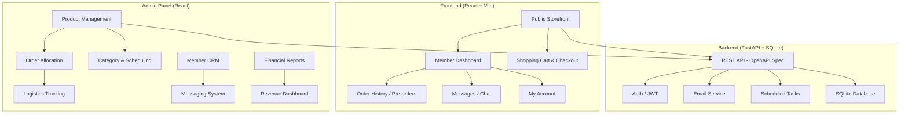
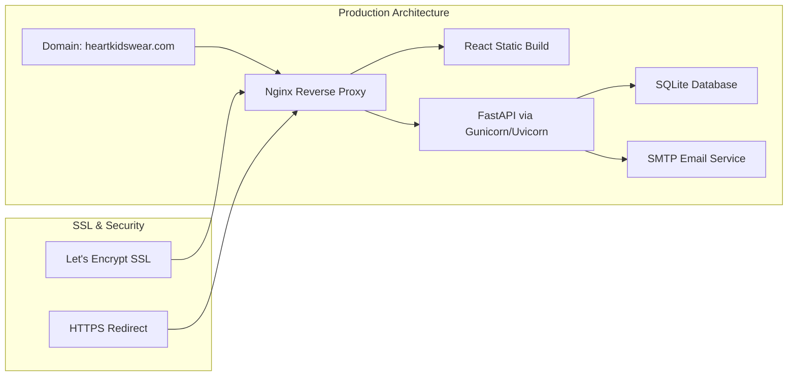

# Heart Kids Wear (心童裝) — Full-Stack E-Commerce Platform

A complete pre-order e-commerce platform for a Taiwanese children's clothing business sourcing from the UK. Built with **React (Vite)** frontend, **Python (FastAPI)** backend, **SQLite** database, and fully documented with **OpenAPI** specification.

---

## System Overview

Heart Kids Wear is a **pre-order model** business where:
- Customers browse and pre-order items (not instant-fulfillment)
- Admin procures items from UK suppliers, ships to Taiwan, then forwards to customers via 7-11 store-to-store or post office delivery
- The system tracks complex procurement → fulfillment → logistics lifecycle
- Payment is via virtual bank account transfer (not real-time credit card)



---

## User Review Required

> [!IMPORTANT]
> **Technology choices confirmed by user:**
> - Frontend: **React** (we'll use Vite for build tooling)
> - Backend: **Python** (we'll use FastAPI for the REST API)
> - Database: **SQLite** (suitable for this scale; can migrate to PostgreSQL later)
> - API Documentation: **OpenAPI/Swagger** (auto-generated by FastAPI)

> [!WARNING]
> **Payment Integration**: The spec mentions virtual bank account transfer (虛擬帳號) integration. For the initial build, we will create the **payment processing interfaces and status management** but use a **mock/manual payment confirmation** flow. A `PAYMENT_GATEWAY_ENABLED` flag in `system_config` will control this — set to `false` initially. All payments are **fully logged in the database** regardless of mock/live mode. Real integration with a Taiwanese payment gateway (e.g., ECPay 綠界, NewebPay 藍新) will require a registered business entity and merchant account — toggling the flag to `true` will activate it.

> [!WARNING]
> **7-11 Logistics API**: The spec references monitoring 7-11 delivery status. The 7-11 C2C API requires a business contract. We will build the **tracking code recording and notification triggers** but use manual status updates initially, with the API integration point clearly defined.

> [!IMPORTANT]
> **Email Service**: For sending verification codes, order notifications, and reminders, we'll integrate with an SMTP service. For development, we'll use a configurable SMTP backend (e.g., Gmail SMTP or Mailgun). The user should confirm their preferred email provider for production.

---

## Resolved Questions & Research Findings

### 1. Hosting — Cost Comparison

| Platform | Type | Monthly Cost | Pros | Cons | Recommended? |
|----------|------|-------------|------|------|--------------|
| **DigitalOcean Droplet** | VPS | **~$6/mo** (1GB RAM) | Cheapest, full control, SSH access | Manual DevOps (SSL, security, updates) | ⭐ Best value |
| **Render** | PaaS | **~$7-14/mo** | Easy deploy, auto-SSL, git push | Free tier has cold starts (30-60s delay) | ⭐ Easiest |
| **Railway** | PaaS | **~$5+/mo** (usage-based) | Great DX, scales to zero | Unpredictable costs on traffic spikes | Good for dev |
| **AWS Lightsail** | VPS | **~$5-10/mo** | AWS ecosystem, reliable | Overkill complexity for small site | Advanced |

> [!TIP]
> **Recommendation**: Start with **Render** ($7/mo for backend + free static frontend) for easiest launch. Migrate to **DigitalOcean Droplet** ($6/mo) when you want more control and lower cost. Both support Let's Encrypt SSL (free).

### 2. 7-11 Store Map Integration

**Research findings**: The 7-11 e-map (`emap.pcsc.com.tw`) does **NOT** offer a public embeddable API or iframe. Options:

| Approach | Viability | Notes |
|----------|-----------|-------|
| ❌ iframe embed | **Blocked** | CORS restrictions, anti-embed mechanisms, unstable |
| ✅ **External link** | **Recommended (Phase 1)** | Link to `emap.pcsc.com.tw` → user copies store info → enters manually |
| ✅ ECPay Logistics API | **Future integration** | ECPay provides integrated 7-11 store map via their logistics SDK. Requires merchant account |
| ✅ Build own store DB | **Future option** | Maintain local store database, build custom map UI |

> [!IMPORTANT]
> **For initial build**: We'll provide a prominent "查詢門市 (Look up store)" button that opens `emap.pcsc.com.tw` in a new tab. Users manually enter store name and number. When ECPay integration is activated later, we'll replace this with their built-in store selector.

### 3. Logo & Brand Assets
**✅ Resolved**: Design UI from scratch based on the specification. We'll create a warm, premium children's clothing aesthetic with heart/love motifs.

### 4. Payment Gateway
**✅ Resolved**: Mock payment for now with `PAYMENT_GATEWAY_ENABLED = false` flag. ECPay (綠界) recommended for future — most popular in Taiwan, supports virtual accounts + 7-11 logistics.

### 5. SSL Certificate
**✅ Resolved**: Let's Encrypt (free), auto-renewed.

### 6. Email Provider — Cost Comparison

| Service | Free Tier | Paid Starting | Best For |
|---------|-----------|---------------|----------|
| **Resend** | 3,000 emails/mo | $20/mo (50K) | ⭐ Best DX, React-friendly |
| **Brevo** | 300 emails/day (~9K/mo) | $25/mo | All-in-one marketing+transactional |
| **Mailgun** | 100 emails/day | $15/mo (10K) | API-first, reliable |
| **Amazon SES** | 3K/mo (12mo trial) | $0.10/1K emails | Cheapest at scale |
| **Gmail SMTP** | 500/day | Free (with limits) | Quick start, low volume |

> [!TIP]
> **Recommendation**: Start with **Resend** (3,000 free emails/month is plenty for initial launch). It has excellent developer experience and simple API integration. Move to **Amazon SES** if volume grows significantly.

---

## Proposed Changes

### Phase 1: Project Foundation & API Specification

---

#### [NEW] Project Structure

```
heart-kids-wear/
├── backend/                          # Python FastAPI backend
│   ├── app/
│   │   ├── __init__.py
│   │   ├── main.py                   # FastAPI app entry point
│   │   ├── config.py                 # Settings & environment config
│   │   ├── database.py               # SQLite connection & session
│   │   ├── models/                   # SQLAlchemy ORM models
│   │   │   ├── __init__.py
│   │   │   ├── user.py               # Member/Admin accounts
│   │   │   ├── product.py            # Products, SKUs, categories
│   │   │   ├── order.py              # Orders, order items
│   │   │   ├── cart.py               # Shopping cart
│   │   │   ├── message.py            # Chat/messaging
│   │   │   ├── points.py             # Points & store credits
│   │   │   ├── payment.py            # Payment records
│   │   │   ├── notification.py       # Notification templates
│   │   │   └── finance.py            # Cost & revenue ledger
│   │   ├── schemas/                  # Pydantic request/response schemas
│   │   │   ├── __init__.py
│   │   │   ├── user.py
│   │   │   ├── product.py
│   │   │   ├── order.py
│   │   │   ├── cart.py
│   │   │   ├── message.py
│   │   │   ├── points.py
│   │   │   ├── payment.py
│   │   │   └── finance.py
│   │   ├── api/                      # API route handlers
│   │   │   ├── __init__.py
│   │   │   ├── auth.py               # Login, register, forgot password
│   │   │   ├── users.py              # Member profile CRUD
│   │   │   ├── products.py           # Product catalog & search
│   │   │   ├── categories.py         # Category management
│   │   │   ├── orders.py             # Order lifecycle
│   │   │   ├── cart.py               # Shopping cart operations
│   │   │   ├── checkout.py           # Checkout flow
│   │   │   ├── messages.py           # Chat & notifications
│   │   │   ├── points.py             # Points & credits mgmt
│   │   │   ├── payments.py           # Payment records
│   │   │   ├── admin/                # Admin-only endpoints
│   │   │   │   ├── __init__.py
│   │   │   │   ├── products.py       # Import/manage products
│   │   │   │   ├── orders.py         # Order allocation & logistics
│   │   │   │   ├── members.py        # Member CRM
│   │   │   │   ├── messages.py       # Bulk/individual messaging
│   │   │   │   ├── finance.py        # Expense/income ledger
│   │   │   │   ├── reports.py        # Revenue & profit reports
│   │   │   │   └── scheduling.py     # Product scheduling
│   │   │   └── router.py             # Main API router
│   │   ├── services/                 # Business logic layer
│   │   │   ├── __init__.py
│   │   │   ├── auth_service.py
│   │   │   ├── email_service.py      # Email sending
│   │   │   ├── order_service.py      # Order lifecycle logic
│   │   │   ├── payment_service.py    # Payment reconciliation
│   │   │   ├── points_service.py     # Points & credits logic
│   │   │   ├── notification_service.py # Auto-reminders & templates
│   │   │   └── scheduler_service.py  # Cron jobs (overdue, expiry)
│   │   ├── middleware/
│   │   │   ├── __init__.py
│   │   │   └── auth.py               # JWT authentication middleware
│   │   └── utils/
│   │       ├── __init__.py
│   │       ├── currency.py           # NT$ formatting
│   │       ├── sku.py                # SKU generation logic
│   │       ├── order_id.py           # Order ID generation (YYMM0001)
│   │       └── member_id.py          # Member ID generation
│   ├── alembic/                      # DB migrations
│   ├── tests/
│   ├── requirements.txt
│   ├── alembic.ini
│   └── .env.example
├── frontend/                         # React (Vite) frontend
│   ├── public/
│   │   └── assets/                   # Logo, favicons
│   ├── src/
│   │   ├── main.jsx
│   │   ├── App.jsx
│   │   ├── index.css                 # Global design tokens
│   │   ├── api/                      # API client (axios)
│   │   │   ├── client.js
│   │   │   ├── auth.js
│   │   │   ├── products.js
│   │   │   ├── orders.js
│   │   │   ├── cart.js
│   │   │   ├── messages.js
│   │   │   └── admin.js
│   │   ├── components/               # Reusable UI components
│   │   │   ├── layout/
│   │   │   │   ├── Header.jsx        # Logo + nav + cart/wishlist/profile/search
│   │   │   │   ├── Footer.jsx        # Social links (FB/IG/LINE)
│   │   │   │   ├── AnnouncementBar.jsx  # Top banner
│   │   │   │   └── Sidebar.jsx       # Admin sidebar menu
│   │   │   ├── common/
│   │   │   │   ├── Modal.jsx
│   │   │   │   ├── Button.jsx
│   │   │   │   ├── Input.jsx
│   │   │   │   ├── Checkbox.jsx
│   │   │   │   ├── Dropdown.jsx
│   │   │   │   ├── Badge.jsx         # Notification badges
│   │   │   │   ├── CurrencyDisplay.jsx # NT$1,000 formatting
│   │   │   │   └── LoadingSpinner.jsx
│   │   │   ├── product/
│   │   │   │   ├── ProductCard.jsx
│   │   │   │   ├── ProductGrid.jsx
│   │   │   │   ├── ProductDetail.jsx
│   │   │   │   ├── SizeChart.jsx
│   │   │   │   ├── SortFilter.jsx
│   │   │   │   └── GroupBuyBanner.jsx
│   │   │   ├── cart/
│   │   │   │   ├── CartDropdown.jsx   # Floating preview
│   │   │   │   ├── CartPage.jsx
│   │   │   │   └── CartItem.jsx
│   │   │   ├── checkout/
│   │   │   │   ├── CheckoutPage.jsx
│   │   │   │   ├── ShippingForm.jsx
│   │   │   │   ├── PaymentSection.jsx
│   │   │   │   ├── DiscountSummary.jsx
│   │   │   │   └── PostPaymentPopup.jsx
│   │   │   ├── member/
│   │   │   │   ├── ProfileDropdown.jsx
│   │   │   │   ├── OrderHistory.jsx
│   │   │   │   ├── PreOrderList.jsx
│   │   │   │   ├── MyAccount.jsx
│   │   │   │   ├── MessageCenter.jsx
│   │   │   │   └── PointsCredits.jsx
│   │   │   ├── chat/
│   │   │   │   ├── ChatWidget.jsx     # Floating "Chat with us!"
│   │   │   │   └── ChatWindow.jsx
│   │   │   └── auth/
│   │   │       ├── LoginForm.jsx
│   │   │       ├── RegisterForm.jsx
│   │   │       └── ForgotPassword.jsx
│   │   ├── pages/                    # Route pages
│   │   │   ├── public/
│   │   │   │   ├── HomePage.jsx
│   │   │   │   ├── ProductListPage.jsx
│   │   │   │   ├── ProductDetailPage.jsx
│   │   │   │   ├── LoginPage.jsx
│   │   │   │   ├── RegisterPage.jsx
│   │   │   │   ├── ForgotPasswordPage.jsx
│   │   │   │   ├── CartPage.jsx
│   │   │   │   ├── CheckoutPage.jsx
│   │   │   │   └── TermsPage.jsx
│   │   │   ├── member/
│   │   │   │   ├── DashboardPage.jsx
│   │   │   │   ├── OrdersPage.jsx
│   │   │   │   ├── MessagesPage.jsx
│   │   │   │   ├── AccountPage.jsx
│   │   │   │   └── WishlistPage.jsx
│   │   │   └── admin/
│   │   │       ├── DashboardPage.jsx
│   │   │       ├── ImportProductsPage.jsx
│   │   │       ├── CategoryManagementPage.jsx
│   │   │       ├── ProductManagementPage.jsx
│   │   │       ├── AllOrdersPage.jsx
│   │   │       ├── OrderAllocationPage.jsx
│   │   │       ├── MemberCRMPage.jsx
│   │   │       ├── MessagingPage.jsx
│   │   │       ├── PaymentLogsPage.jsx
│   │   │       ├── ExpenseLedgerPage.jsx
│   │   │       └── ReportsDashboardPage.jsx
│   │   ├── context/                  # React Context providers
│   │   │   ├── AuthContext.jsx
│   │   │   ├── CartContext.jsx
│   │   │   └── NotificationContext.jsx
│   │   ├── hooks/                    # Custom hooks
│   │   │   ├── useAuth.js
│   │   │   ├── useCart.js
│   │   │   └── useNotifications.js
│   │   ├── utils/
│   │   │   ├── currency.js           # NT$ formatting
│   │   │   ├── validators.js
│   │   │   └── constants.js
│   │   └── router.jsx                # React Router config
│   ├── package.json
│   ├── vite.config.js
│   └── .env.example
├── openapi/
│   └── openapi.yaml                  # Full OpenAPI 3.1 specification
├── docs/
│   ├── deployment.md                 # Deployment guide
│   ├── database-schema.md            # ERD & schema docs
│   └── api-guide.md                  # API usage guide
├── docker-compose.yml                # Dev environment
├── Dockerfile.backend
├── Dockerfile.frontend
└── README.md
```

---

### Phase 2: Database Schema (SQLite via SQLAlchemy)

#### [NEW] `backend/app/models/` — Complete Database Models

The database schema covers all entities from the specification:

```mermaid
erDiagram
    MEMBERS {
        int id PK
        string member_id UK "2604004 format"
        string email UK
        string password_hash
        string full_name
        date date_of_birth
        string phone
        string contact_address
        string ig_handle
        string fb_handle
        string line_handle
        string marketing_source "FB/IG/LINE"
        decimal store_credits "永久有效"
        int total_purchases
        int overdue_count
        string admin_remarks
        boolean is_blacklisted
        boolean agreed_to_rules
        datetime created_at
    }

    SHIPPING_ADDRESSES {
        int id PK
        int member_id FK
        string type "7-11 or POST_OFFICE"
        string store_name
        string store_number
        string recipient_name
        string recipient_phone
        string address
        boolean is_primary
    }

    CATEGORIES {
        int id PK
        int parent_id FK "NULL for tier-1"
        string name_zh
        string name_en
        string type "GENDER or AGE"
        int sort_order
    }

    GROUP_CAMPAIGNS {
        int id PK
        string title "隱藏品牌名"
        text promotional_copy
        datetime scheduled_publish
        datetime scheduled_delist
        boolean is_active
    }

    PRODUCTS {
        int id PK
        int category_id FK
        int campaign_id FK
        string name_zh
        string name_en
        string supplier
        decimal cost_gbp
        decimal retail_price_twd
        text description
        string size_chart_url
        boolean is_listed
        boolean is_archived
        datetime created_at
    }

    PRODUCT_VARIANTS {
        int id PK
        int product_id FK
        string sku UK "Independent SKU per size"
        string size "2-3y, 3-4y, etc."
        string color
        string style
        int stock_quantity
        boolean is_available
    }

    PRODUCT_IMAGES {
        int id PK
        int product_id FK
        string image_url
        int sort_order
        boolean is_primary
    }

    ORDERS {
        int id PK
        string order_number UK "26040001 format"
        int member_id FK
        string status "PENDING/CONFIRMED/PAID/SHIPPED/ABANDONED"
        string shipping_type "7-11 or POST_OFFICE"
        decimal subtotal
        decimal shipping_fee
        decimal discount_amount
        decimal credits_used
        decimal total
        string payment_method
        datetime payment_deadline
        datetime payment_date
        string tracking_code
        datetime shipped_date
        text travel_notes
        text customer_notes
        datetime created_at
    }

    ORDER_ITEMS {
        int id PK
        int order_id FK
        int variant_id FK
        int quantity
        decimal unit_price
        string preorder_status "IN_PROGRESS/REGISTERED/OUT_OF_STOCK"
        string customer_remarks "給客人看"
        string admin_remarks "僅後台"
        datetime ordered_date
        string ordered_date_text "支援 2026/6/7(1)"
        datetime arrival_date
        string arrival_date_text
        datetime defect_date
        text defect_description
        datetime repurchase_date
        datetime discontinued_date
        datetime shipped_to_tw_date
        string box_color_tag
        datetime preorder_submitted_at "精確到秒"
    }

    WISHLIST {
        int id PK
        int member_id FK
        int product_id FK
        datetime added_at
    }

    CART_ITEMS {
        int id PK
        int member_id FK
        int variant_id FK
        int quantity
        datetime added_at
    }

    MESSAGES {
        int id PK
        int sender_id FK "NULL=system"
        int recipient_id FK
        text content
        boolean is_read
        boolean is_bulk
        string message_type "PERSONAL/BULK/SYSTEM"
        datetime created_at
    }

    MESSAGE_TEMPLATES {
        int id PK
        string name
        text content "supports {{name}}, {{tracking}}"
        string template_type
    }

    POINTS_CARDS {
        int id PK
        int member_id FK
        decimal amount
        datetime expiry_date
        boolean is_used
        datetime created_at
    }

    MEMBER_EVENTS {
        int id PK
        int member_id FK
        date event_date
        string event_type "LATE_PAYMENT/STOCKOUT_REFUND/PACKAGE_RETURNED"
        text event_description
    }

    PAYMENT_RECORDS {
        int id PK
        int order_id FK
        decimal amount
        string method
        string virtual_account
        string last_5_digits
        datetime paid_at
    }

    EXPENSE_LEDGER {
        int id PK
        date entry_date
        decimal amount_twd
        decimal amount_gbp
        string category "SALARY/UK_SHIPPING/INTL_FREIGHT/PACKAGING"
        text formula_notes
        text remarks
    }

    INCOME_LEDGER {
        int id PK
        date entry_date
        int member_id FK
        decimal amount_twd
        text remarks
    }

    MEMBERS ||--o{ SHIPPING_ADDRESSES : has
    MEMBERS ||--o{ ORDERS : places
    MEMBERS ||--o{ CART_ITEMS : has
    MEMBERS ||--o{ WISHLIST : saves
    MEMBERS ||--o{ MESSAGES : exchanges
    MEMBERS ||--o{ MEMBER_EVENTS : logs
    MEMBERS ||--o{ POINTS_CARDS : receives
    CATEGORIES ||--o{ CATEGORIES : "parent-child"
    CATEGORIES ||--o{ PRODUCTS : contains
    GROUP_CAMPAIGNS ||--o{ PRODUCTS : groups
    PRODUCTS ||--o{ PRODUCT_VARIANTS : "has variants"
    PRODUCTS ||--o{ PRODUCT_IMAGES : "has images"
    ORDERS ||--o{ ORDER_ITEMS : contains
    ORDERS ||--o{ PAYMENT_RECORDS : "paid via"
    PRODUCT_VARIANTS ||--o{ ORDER_ITEMS : "ordered as"
    PRODUCT_VARIANTS ||--o{ CART_ITEMS : "carted as"
    MEMBERS ||--o{ INCOME_LEDGER : "revenue from"
```



---

### Phase 3: OpenAPI Specification & Backend API

#### [NEW] `openapi/openapi.yaml` — Full OpenAPI 3.1 Spec

All endpoints auto-generated and documented by FastAPI's built-in OpenAPI support. Key API groups:

| API Group | Endpoints | Description |
|---|---|---|
> [!IMPORTANT]
> **API Design Rule**: All APIs use only **GET** (read) and **POST** (write/create/update). No PUT or DELETE verbs. Updates and removals are handled via POST with appropriate action parameters.

| API Group | Endpoints | Description |
|---|---|---|
| **Auth** | `POST /api/auth/register`, `POST /api/auth/login`, `POST /api/auth/forgot-password`, `POST /api/auth/verify-code` | Registration with full shipping info, marketing survey, terms agreement |
| **Products** | `GET /api/products`, `GET /api/products/{id}`, `GET /api/products/campaign/{id}` | Product browsing, filtering by category/price, group campaigns |
| **Categories** | `GET /api/categories` | Two-tier category tree (Gender → Age) |
| **Cart** | `GET /api/cart`, `POST /api/cart/add`, `POST /api/cart/update`, `POST /api/cart/remove` | Cart operations with stock validation |
| **Checkout** | `POST /api/checkout/submit`, `GET /api/checkout/payment-status` | Multi-step checkout: shipping → terms → payment |
| **Orders** | `GET /api/orders`, `GET /api/orders/{order_number}` | Order history with pre-order statuses |
| **Messages** | `GET /api/messages`, `POST /api/messages/send`, `GET /api/messages/unread-count`, `POST /api/messages/mark-read` | Chat with auto-reply |
| **Members** | `GET /api/members/profile`, `POST /api/members/profile/update`, `GET /api/members/points`, `GET /api/members/credits` | Profile management, points & credits |
| **Wishlist** | `GET /api/wishlist`, `POST /api/wishlist/add`, `POST /api/wishlist/remove` | Wish list management |
| **Admin: Products** | `POST /api/admin/products/import`, `POST /api/admin/products/update`, `POST /api/admin/products/archive`, `POST /api/admin/products/relaunch` | Product import, update, archiving, relaunch |
| **Admin: Orders** | `GET /api/admin/orders`, `GET /api/admin/orders/allocation/{product_id}`, `POST /api/admin/orders/items/update-logistics`, `POST /api/admin/orders/create-for-customer` | Allocation UI, logistics, order on behalf |
| **Admin: Members** | `GET /api/admin/members`, `GET /api/admin/members/{id}`, `POST /api/admin/members/update-credits`, `POST /api/admin/members/add-event`, `POST /api/admin/members/update-remarks` | CRM with event timeline, credit adjustment |
| **Admin: Messages** | `POST /api/admin/messages/send-individual`, `POST /api/admin/messages/send-bulk`, `GET /api/admin/messages/templates`, `POST /api/admin/messages/templates/create` | Bulk messaging with dynamic variables |
| **Admin: Finance** | `GET /api/admin/finance/expenses`, `POST /api/admin/finance/expenses/add`, `GET /api/admin/finance/income`, `POST /api/admin/finance/income/add`, `GET /api/admin/reports` | Ledger management & analytics |
| **Admin: Scheduling** | `POST /api/admin/products/schedule-publish`, `POST /api/admin/products/batch-delist` | Scheduled publish/delist |
| **Admin: Payments** | `GET /api/admin/payments`, `POST /api/admin/payments/confirm` | Payment log viewing & manual confirmation |

#### [NEW] `backend/app/main.py` — FastAPI Application

- CORS configuration for React frontend
- JWT-based authentication (access + refresh tokens)
- Auto-generated OpenAPI/Swagger documentation at `/docs`
- Background task scheduler for overdue payment reminders, point expiry notifications

> [!NOTE]
> **Full Database Schema Documentation**: See [database_schema.md](file:///C:/Users/johny/.gemini/antigravity-ide/brain/fefc7db5-5ec2-480a-bdca-954baccc23a1/database_schema.md) for complete table specifications, indexes, field constraints, enums, and business logic encoded in the schema. Includes 19 tables with all relationships.

#### [NEW] `backend/app/services/` — Business Logic

Key business rules from the spec:

| Rule | Implementation |
|---|---|
| **Order ID Format** | `YYMM` + 4-digit sequential (e.g., `26040001`) |
| **Member ID Format** | `YYMM` + 3-digit sequential (e.g., `2604004`) |
| **SKU Logic** | Each size/variant gets independent SKU |
| **NT$4,000 Discount** | Auto-deduct NT$60 when subtotal ≥ NT$4,000 (excl. shipping) |
| **Shipping Lock** | Force POST_OFFICE when items > 15 |
| **7-11 Fee** | Fixed NT$60; POST_OFFICE fixed NT$80 |
| **Store Credits** | Auto-refund on discontinued; permanent; auto-apply at checkout |
| **Points** | Percentage-based; 3-month expiry; expiry notification |
| **Overdue Logic** | Day 0: deadline → Day 1: grace (3 days, manual transfer only) → Day 3-4: final warning → auto-abandon + blacklist |
| **Currency Format** | All amounts displayed as `NT$X,XXX` |

---

### Phase 4: Frontend — User Interface (React + Vite)

#### [NEW] Public Storefront Pages

| Page | Key Features |
|---|---|
| **Homepage** | Announcement banner ("Register for 60 pts"), product grid with group campaigns, promotional banners |
| **Product List** | Two-tier category filter, price sort (low→high / high→low), product cards with images |
| **Product Detail** | Image gallery, size chart link, variant selector, "Add to Cart" + discount reminder ("NT$60 off on NT$4,000+"), stock status |
| **Login** | Email (case-insensitive) + password, eye toggle, "Remember Me", error popup, "Forgot Password" link |
| **Register** | Full form: name, DOB, phone, email, address, 7-11 shipping info (store/store#/recipient), marketing survey (FB/IG/LINE), shopping rules checkbox, social links |
| **Cart** | Item list (photo/name/size/qty/stock/subtotal), floating preview dropdown, pre-order confirmation popup |
| **Checkout** | Auto-filled shipping, address history dropdown, shipping method (7-11/Post Office with 15-item lock), discount summary, travel notes, terms checkbox (mandatory), payment info, post-payment popup |

#### [NEW] Member Dashboard Pages

| Page | Key Features |
|---|---|
| **Orders History** | Left-sidebar layout: Photo → Name → Style → Spec → Qty → Pre-order Status (In Progress/Registered/Out of Stock), customer-visible remarks |
| **Messages** | Chat interface with auto-reply, chronological message history |
| **My Account** | Top: read-only name, DOB, phone, address. Bottom: edit shipping info, change email/password, view points & credits |
| **Wishlist** | Saved products grid |

#### [NEW] Global UI Components

- **Header**: Logo (links to home), search icon, wishlist heart, profile dropdown, cart icon with item count badge
- **Footer**: FB/IG/LINE social links (permanent)
- **Chat Widget**: Floating bottom-right "Chat with us!" circle → expands to chat window with auto-reply
- **Notification Badge**: Red bubble for unread messages on profile icon

---

### Phase 5: Frontend — Admin Interface (React)

#### [NEW] Admin Panel Pages

| Page | Key Features |
|---|---|
| **Dashboard** | Overview stats: pending orders, unread messages, recent activity |
| **Import Products** | Product creation form: name, category (2-tier), campaign assignment, size chart upload, images, pricing (GBP cost + TWD retail), variant/SKU generation |
| **Category Management** | Scheduled publish/delist, product archiving, one-click relaunch |
| **Product Management** | 4-tab view: Unordered → Undelivered → Unshipped → In-Progress. Order-on-behalf-of-customer feature |
| **All Orders** | Advanced multi-dimensional search/filter bar. Split-screen allocation: left (specs + quantities) ↔ right (buyer list with status) |
| **Order Detail** | Order #, checkout date, payment status, tracking code (clickable), logistics checkboxes (auto-date + manual override), dual-track notes |
| **Member CRM** | Search by name/ID, full profile view, admin remarks (delinquency tagging), event timeline, quick action buttons (💬 message, 👤 profile, $ credits) |
| **Messaging** | Individual + bulk messaging, template builder with dynamic variables ({{name}}, {{tracking}}), read/unread tracking |
| **Payment Logs** | Filterable by year/month/day/timestamp, auto-archived records |
| **Expense Ledger** | Monthly expense/income entries, categorized costs (salary, UK shipping, intl freight with formula support, packaging), income by customer |
| **Reports Dashboard** | Date range filters, metrics: total orders, items, shipping costs, procurement costs, gross revenue (w/ and w/o shipping), net profit, AOV |

#### [NEW] Admin Sidebar Menu (per spec order)

1. 匯入商品 (Import Products)
2. 目錄管理 (Category Management)
3. 商品管理 / 單品訂貨 (Product Management)
4. 所有訂單 (All Orders)
5. 會員資料 (Member CRM)
6. 訊息管理 (Messaging)
7. 付款紀錄 (Payment Logs)
8. 成本與收支 (Expense Ledger)
9. 營業額報表 (Reports Dashboard)

---

### Phase 6: Automated Systems & Notifications

#### [NEW] `backend/app/services/scheduler_service.py`

| Automation | Trigger | Action |
|---|---|---|
| **Payment Deadline Reminder** | Checkout deadline day | Auto-send final reminder email |
| **Grace Period Start** | Deadline + 1 day | Lock payment to manual transfer, send grace notice |
| **Final Warning** | Deadline + 3-4 days | Send ultimate warning, prepare for auto-abandon |
| **Auto-Abandon** | Grace period expired | Release inventory, mark order "Abandoned", increment overdue count, annotate account |
| **Points Expiry Warning** | Points nearing 3-month expiry | Send expiry notification with template |
| **Scheduled Publish** | Preset datetime | Auto-list products/campaigns |
| **Scheduled Delist** | Preset datetime | Auto-delist products |
| **Store Credit Refund** | Admin marks item "Discontinued" | Auto-credit amount to member's store credits |

---

### Phase 7: Deployment & Going Public

#### [NEW] `docs/deployment.md` — Production Deployment Guide



**Deployment Options (simplest to most scalable):**

| Option | Best For | Cost | Setup Difficulty |
|---|---|---|---|
| **Railway / Render** | Quick launch, small traffic | ~$7-15/mo | ⭐ Easy |
| **DigitalOcean Droplet** | Full control, moderate traffic | ~$6-12/mo | ⭐⭐ Medium |
| **AWS Lightsail** | Scalable, enterprise-ready | ~$5-40/mo | ⭐⭐⭐ Advanced |
| **VPS + Docker** | Self-managed, maximum control | Varies | ⭐⭐ Medium |

**Production Checklist:**
- [ ] Purchase domain name
- [ ] Set up DNS (A record pointing to server)
- [ ] Configure SSL certificate (Let's Encrypt)
- [ ] Set up Nginx as reverse proxy
- [ ] Build React for production (`npm run build`)
- [ ] Run FastAPI with Gunicorn + Uvicorn workers
- [ ] Configure environment variables (database path, JWT secret, SMTP credentials)
- [ ] Set up automated backups for SQLite database
- [ ] Configure CORS for production domain
- [ ] Set up email service (SMTP) for transactional emails
- [ ] Test all notification flows end-to-end
- [ ] Set up monitoring/logging (optional: Sentry, UptimeRobot)

---

## Development Phases & Timeline

| Phase | Description | Estimated Effort |
|---|---|---|
| **Phase 1** | Project setup, OpenAPI spec generation, database schema | 2-3 days |
| **Phase 2** | Backend API — Auth, Products, Categories, Cart | 3-4 days |
| **Phase 3** | Backend API — Orders, Checkout, Payments, Points/Credits | 3-4 days |
| **Phase 4** | Backend API — Admin endpoints, Messaging, Finance, Reports | 3-4 days |
| **Phase 5** | Frontend — Public storefront (Home, Products, Cart, Checkout) | 4-5 days |
| **Phase 6** | Frontend — Member dashboard (Orders, Messages, Account) | 2-3 days |
| **Phase 7** | Frontend — Admin panel (all 9 admin pages) | 5-7 days |
| **Phase 8** | Automated systems (scheduler, notifications, overdue logic) | 2-3 days |
| **Phase 9** | Testing, polish, responsive design, deployment setup | 2-3 days |

---

## Verification Plan

### Automated Tests
```bash
# Backend unit tests
cd backend && python -m pytest tests/ -v

# API integration tests
cd backend && python -m pytest tests/integration/ -v

# Frontend build verification
cd frontend && npm run build
```

### Manual Verification
- Complete user registration flow with all required fields
- Product browsing, filtering, sorting
- Add to cart → checkout → payment confirmation flow
- Admin: import product → set up campaign → allocate orders
- Overdue payment escalation flow (all 4 stages)
- Message sending (individual + bulk with templates)
- Points & store credits lifecycle
- Financial reports accuracy
- Responsive design on mobile/tablet/desktop
- Email notification delivery
